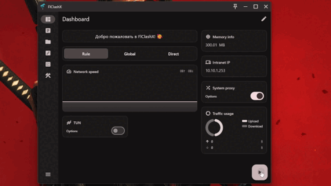

<div>

[**English**](README.md)

</div>

## MeowClash

> MeowClash - это форк [FlClashX](https://github.com/pluralplay/FlClashX)

[](https://github.com/Loischsiy/MeowClash/releases/)[](https://github.com/Loischsiy/MeowClash/releases/)[](LICENSE)

Мультиплатформенный прокси-клиент на базе ClashMeta, простой и удобный в использовании, с открытым исходным кодом и без рекламы.

на Десктопе:
<p style="text-align: center;">
    
</p>

на Мобильных устройствах:
<p style="text-align: center;">
    
</p>

## Особенности

✈️ Мультиплатформенность: Android, Windows, macOS и Linux

💻 Адаптивность под разные размеры экранов, Доступно несколько цветовых тем

💡 Дизайн на основе Material You, UI в стиле [Surfboard](https://github.com/getsurfboard/surfboard)

☁️ Поддержка синхронизации данных через WebDAV

✨ Поддержка ссылок на подписки, Темный режим

## Использование

### Linux

⚠️ Перед использованием убедитесь, что установлены следующие зависимости

   ```bash
    sudo apt-get install libayatana-appindicator3-dev
    sudo apt-get install libkeybinder-3.0-dev
   ```

### Android

Поддерживаются следующие действия (actions)

   ```bash
    com.meowclash.app.action.START
    
    com.meowclash.app.action.STOP
    
    com.meowclash.app.action.TOGGLE
   ```

## Скачать

<a href="https://github.com/Loischsiy/MeowClash/releases"></a>

## Сборка

1. Обновите подмодули
   ```bash
   git submodule update --init --recursive
   ```

2. Установите окружение `Flutter` и `Golang`

3. Соберите приложение

    - android

        1. Установите `Android SDK` , `Android NDK`

        2. Установите переменные окружения `ANDROID_NDK`

        3. Запустите скрипт сборки

           ```bash
           dart .\setup.dart android
           ```

    - windows

        1. Вам понадобится клиент на Windows

        2. Установите `Gcc`，`Inno Setup`

        3. Запустите скрипт сборки

           ```bash
           dart .\setup.dart windows --arch <arm64 | amd64>
           ```

    - linux

        1. Вам понадобится клиент на Linux

        2. Запустите скрипт сборки

           ```bash
           dart .\setup.dart linux --arch <arm64 | amd64>
           ```

    - macOS

        1. Вам понадобится клиент на macOS

        2. Запустите скрипт сборки

           ```bash
           dart .\setup.dart macos --arch <arm64 | amd64>
           ```

## Изменения в форке

### Система переопределения провайдера `meowclash-*` (май 2026 г.)

Пользовательская система переопределения `meowclash-*` была полностью удалена. Эти ключи всегда считывались только из **заголовков ответа** HTTP подписки (а не из тела YAML профиля), поэтому их добавление в профиль никогда не давало никакого эффекта. Расшифровка подписки осталась полностью работоспособной.

**Сохранено и по-прежнему работает:**
- Расшифровка зашифрованных подписок — `meowclash-password`, `meowclash-password-iterations`.
- Другие заголовки, не подлежащие переопределению: `announce`, `support-url`, `profile-update-interval`, `x-hwid-limit` (с диалоговым окном ограничения устройств).